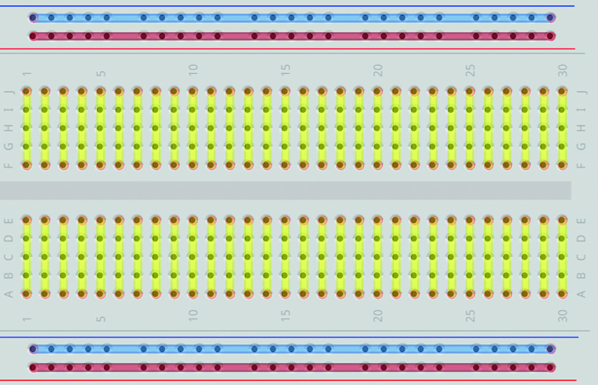
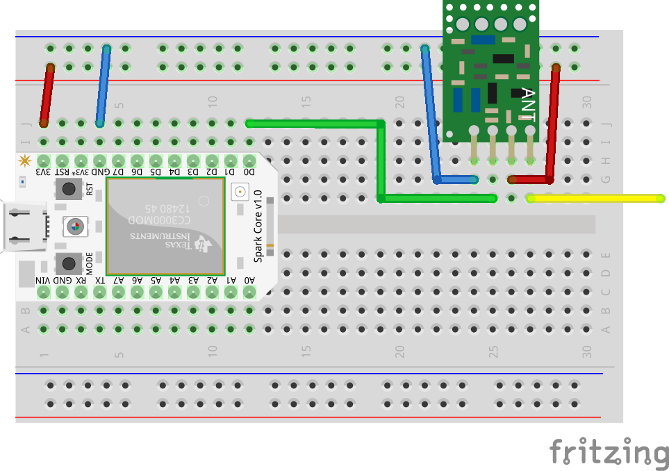

# Basic Smart Home using Spark Core

## Introduction

Commercially available Smart Home solutions start with couple of hundred dollars.
In this workshop you will build a remotely controlled light available from any
place on earth using very cheap 433/434MHz modules and Arduino compatibile Spark Core.
You will learn how to setup, program a Spark Core and how to leverage its cloud infrastructure.

## Required hardware

We'll need a microcontroller which is a small computer on a chip able to work without
screens, keyboards and other peripherals. In this case, we'll use [Spark Core](https://www.spark.io/)
module with built-in WiFi. Other than that you will need:

* Breadboard (included with Spark Core)
* Bunch of wires ([Buy for $3.9](http://eud.dx.com/product/breadboard-jumper-wires-for-electronic-diy-70-cable-pack-844080208?Utm_rid=62061796&Utm_source=affiliate))
* 433MHz transmitter ([Buy for $1.84](http://eud.dx.com/product/433mhz-wireless-transmitter-module-superregeneration-for-arduino-green-844149254?Utm_rid=62061796&Utm_source=affiliate))
* Some remote controlled sockets ([Buy 2 for $21.78](http://www.dx.com/p/ts-868-eu-plug-2-1-remote-control-socket-white-313934?Utm_rid=62061796&Utm_source=affiliate))
* A lamp or something that will tell you when it's on :)

## Connecting Core to WiFi

When you connect the Core via USB, it's flashing blue. This means that it wants to
connect to WiFi but doesn't know which one. To enter this info you will need
an app on your computer to communicate with it (at home you can use your smartphone
but where there are many Cores at the same time this could make some troubles).

* On Windows install [PuTTY](http://www.chiark.greenend.org.uk/~sgtatham/putty/) and [Spark Core Drivers](https://s3.amazonaws.com/spark-website/Spark.zip)
* For OS X install [CoolTerm](http://freeware.the-meiers.org/)
* On Linux you should have [screen](https://www.gnu.org/software/screen/)

Open a serial port over USB using the standard settings, which should be:

* Baudrate: 9600
* Data Bits: 8
* Parity: none
* Stop Bits: 1

Once you've opened a serial connection, hit **w** key. Core should respond with:

```
SSID:
```

Type network name (it should be at the end of this tutorial). Remember about lower
and upper characters because it's case sensitive. Then hit **Enter**/**Return**.

Next Core will ask about security:

```
Security 0=unsecured, 1=WEP, 2=WPA, 3=WPA2:
```

It's usually WPA2 but to be sure contact your network administrator. Entering
wrong security type won't allow Core to work.

Last is network password:

```
Wifi Password:
```

type the password and after submitting you should see similar screen:

```
Awesome. Now we'll connect!

If you see a pulsing cyan light, your Spark Core
has connected to the Cloud and is ready to go!

If your LED flashes red or you encounter any other problems,
visit https://www.spark.io/support to debug.

    Spark <3 you!


Done!  Your core should now restart.
```

Now after couple of seconds, Core should slowly pulsing cyan. This means it's
working connected to the cloud!

## Using web based Build app

Easiest way to program Core is to use web IDE called **Build**. Go to
[https://www.spark.io/login](https://www.spark.io/login) and enter credentials
from end of this tutorial.

After logging in, you should see a panel asking to create new app:


Type **Smart Home** as a name and hit **Enter/Return**.

Before we start, it's good to know how to use our tools. Lets check out the
sidebar on the left:

*  - **Flash** is used to update the Core with current app
*  - **Verify** checks is current app doesn't contain errors
*  - **Save** well, it saves current program ;)
*  - **Code** shows information about current app and allows to switch between other apps
*  - **Libraries** shows community created libraries for various hardware
*  - **Docs** opens documentation for Spark Core
*  - **Cores** shows which of your cores are online and allows to add new ones

## First app

Lets test is everything is ok, by flashing Core with app which blinks using built-in LED.

Go to **Code** and on the bottom under **Example apps** there should be **BLINK AN LED** example.

You should see a simple app code on the right. If you're not familiar with Arduino
(which Spark Core is compatibile with), in every app there are two required functions:

* **setup()** - which is called only once after powering on the Core and usually consists of setting up ports and variables
* **loop()** - this function is called over and over again until power is disconnected. Contains all main parts of the app.  

Code is heavily commented so take some time to read them and understand how it works.

When you're ready, click **Flash** button on the sidebar. After this the Core will
flash magenta which means it's updating. When it goes back to cyan, check out
the LED near USB port. It's blinking! :)

## Turning light on and off

Ok, we verified it's working. Now it's time to play around with hardware.

Firstly take the socket, plug it in into outlet. Then connect a lamp to the socket.
You can try using remote first to check if it works. If it does lets go to connecting
transmitter to the Core. Take out the breadboard, wires and 433MHz module.

Before you connect anything, here's small breadboard cheat sheet:



> **Remember** that connecting ground (GND) to positive (Vcc, 3V3, 5V) may destroy
> the Core and even your USB. This is why it's better to always check your wires twice.

Now lets connect 433MHz transmitter:



> **Hint** color of the wires doesn't count. But keeping the same color for every
> rail (i.e. blue for GND and red for Vcc) will help you avoid any mistakes when
> connecting them.

Few instructions to help you:

* Connect the wires with Core disconnected from your computer
* Hold transmitter with labels (containing *ANT* text and round metal oscilator)
side facing you
* Leave yellow wire hanging as it will be our "antenna"

Great, now lets go to the software part. Go to **Build** -> **Code** and choose
**SMART HOME**.

Then go to **Libraries**, find **RCSwitch** and click blue button **INCLUDE IN APP**.

> **RCSwitch** is an open source library which handles all communication with
> 433/434MHz devices like our sockets. It also works on Arduino and Raspberry Pi.

After **#include** and before **setup()** type:

```
RCSwitch mySwitch = RCSwitch();
```

This will initialise **RCSwitch** library. Now we have to tell it which Core pin
to use for transmitting data. Second variable we have to set is pulse length.
Different sets of plugs have different pulse length so when using more of them,
you can address only one. Pulse length of your socket/remote can be obtain by
listening using **ReceiveDemo_Advanced.ino** example of **RCSwitch** library,
but our sockets have been already inspected and you can find pulse length at the
and of this tutorial. We'll set up all this in **setup()** function:

```
void setup() {
  // Transmitter is connected to Spark Core Pin D0
  mySwitch.enableTransmit(D0);

  // Set pulse length.
  mySwitch.setPulseLength(PULSE_LENGTH);
}
```

When this is done, we can blink again but this time using a lamp! Type this inside
**loop()** function:

```
  mySwitch.sendTriState("YOUR_ON_TRISTATE_CODE");
  delay(1000);
  mySwitch.sendTriState("YOUR_OFF_TRISTATE_CODE");
  delay(1000);
```

**Flash** it and behold your remote controlled lamp!

## Adding cloud function
